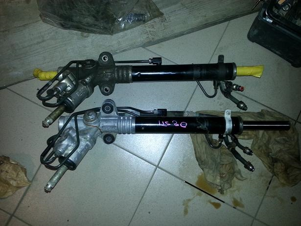
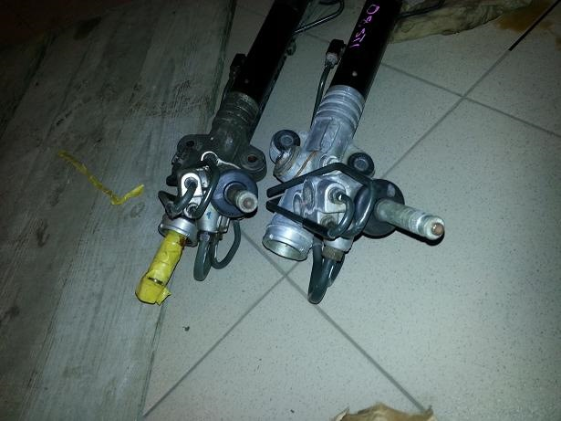
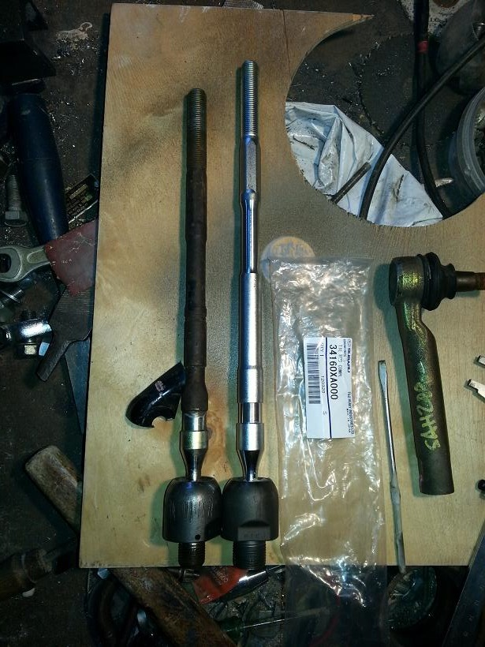
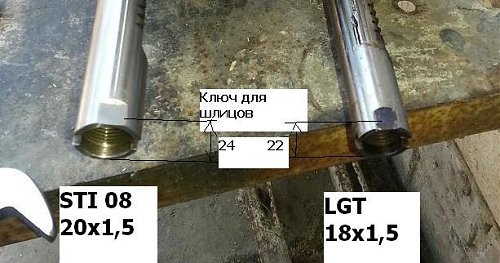
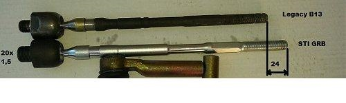
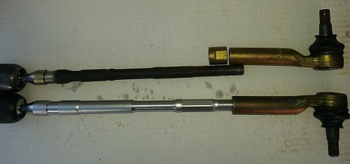

# СТИшная рейка на Legacy B13 (BL)

Собственно установка уже давно была сделана, но записи в БЖ не было (как и собственно еще о множестве модификаций, которые сделаны, но не представлены широкой общественности)) ).

Касательно причин замены рейки — их как минимум 2: Постоянная жажда тюнинга (неприязнь к атмостоковым узлам)) ) и болячка Легасей в виде стуков в рейке.

Инфа по "длине" реек (Легаси седаны, про Ауты не вникал ):
— Легаси В13 атмосферки 2.0л и 2.5л — 3,2 оборота из крайнего до крайнего положения,
— Легаси В13 турбо и атмо 3.0л — 2,8 оборота,
— STI GRB 2.7 оборота

Учитывая преемственность кузовов Легаси B13 (BL BP) и Импрезы (GRB) была выбрана рейка от новой СТИ (У меня Легаси европейская, соответственно СТИха донор тоже леворукая)) ). Корпуса реек, посадочные крепления, шлицы под карданчик, подключение гидравлики- все АБСОЛЮТНО идентичное. То есть STI рейка ставится точно болт-он вместо родной.
Отличия только в рулевых тягах. Тяги ввиду отличия резьбы на штоках реек тоже нужны стишные. Они немного длинее Легасевых и соответственно нужно укоротить связки тяга-наконечник примерно на 20мм. Я укоротил на 24, то по запасу резьбы после регулировки схождения можно сделать вывод что хватило бы и около 16-20 мм укорочения. Мне это было удобно сделать со стороны наконечников — просверлив глубже отверстия и дорезав резьбу (на фотках видно, хотя это не догма и возможно кому-то понравится другой способ).

У СТИшной рейки присутствует резиновая магистраль, что по одной из версий положительно влияет на уменьшение стуков от микрогидроударов в гидравлической системе.

На выходе имеем "короткую" рейку для активной рулежки и тишину на мелких неровностях (возможно на максимальном вывороте иногда и проскакивает "фирменный" субаровский стучек, но он не соизмерим со стуком Легасевой рейки)

Вопрос -который может возникнуть — влияет ли установка рейки с отличным от заводского передаточным числом на систему ВДС? -это к сожалению мне не известно, так как у меня этой системы нет и соответственно в этот вопрос я не вникал.

