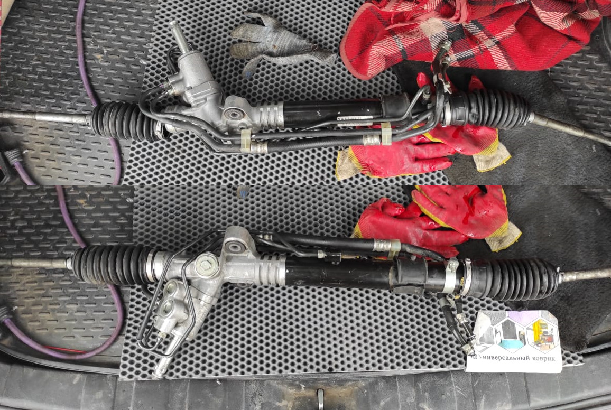

# Ура! Наконец-то! Вау! Как клёво рулится

"Ура! Наконец-то! Вау! Как клёво рулится!" — крутится в голове после нескольких лет мучений с родной люфтящей рулевой рейкой, методично постукивающей в повороте на каждой мелкой ямочке, что даже успело стать нормой и я забыл как по истине должна рулиться Субару!

34110-VA120 — ориганальная леворульная гидро-рейка SHOWA с Subaru WRX STi VA (04.2014 — 06.2017), выуженная далеко не с первого раза на просторах барахолки драйва за 25 тысяч рублей. Состояние — идеал. Даже на диагностике в реечном СТО мастер пустил отнюдь не скупую мужскую слюну.

Запчасти на фото: Z00706, 34110VA120, 834110, 34110AG041

Мануал по кузову VA нам гласит, что рейка имеет 2,5 оборота от упора до упора и передаточное соотношение 13:1 против 3.0/турбо рейки, имеющей 2,8 оборота и передаточное соотношение 15:1.

По установке не так много примеров, информация местами разная и противоречивая, но могу сказать следующее:
— Рулевые наконечники если и не на всех, то на основной массе субарей одинаковые.
— Рулевые тяги на новой рейке не только на OBK (Outback), но и на BL и BP укорачивать не надо! (Кто-то говорит, что надо укорачивать. Зачем — непонятно). Схождение выставляется и так.
— Рулевой карданчик так же остается родной. Единственное, что на BL/BP, в отличие от OBK, при наличии можно поставить карданчик 34170-VA030 от той же STi VA. Он подходит по длине и у него отсутствует демпфер, обеспечивая тем самым бóльшую информативную связь с колёсами.

Слева направа: 1. STI 2014+ — 2. Legacy BL/BP — 3. Outback B13

