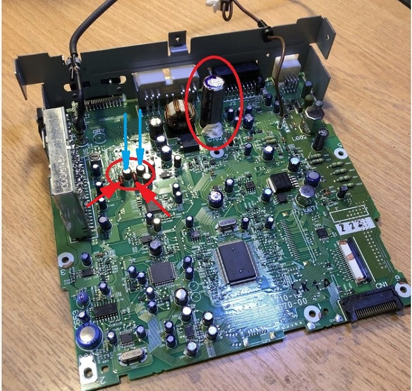

# улучшение звучания штатной магнитолы — есть нюансы

Дальнейшее нахождение в самоизоляции дает время на очередные изыскания по внедрению улучшений в любимом автомобиле.
Уже много было статей было на тему улучшения звучания аудио системы в автомобиле — от бюджетного, когда вносятся минимальные доработки в штатную систему, до кардинального, когда выстраивается система высокого класса.
Вообщем каждый решает по возможностям и желанию.
Вспомнил со времен юности : Меломаны слушают музыку, аудиофилы — вслушиваются в искажения (с)
Будем все-таки слушать музыку )))
Далее будет немало текста, поэтому если не особо интересно, листаем вниз, к картинкам ))

Вид штатного ГУ лично меня устраивает и менять на что-то другое останавливают разные факторы, но если честно — то это больше стоимость. Так как точно знаю, что не остановлюсь на просто замене магнитолы, а начну строить систему. Ну а лишних 50-70 тыс. рублей сейчас нет.

Посему пока выход из положения — это замена выходного усилителя НЧ в штатном ГУ.
По сути, такое решение можно отнести ко всем автомагнитолам, работающих без внешнего усилителя.

По большому, как показывает практика, значительная чаcть магнитол собрана на обычных микросхемах УНЧ серии TDA…Некоторые совсем с редкостным г…И только немногие магнитолы имеют в своем составе УНЧ класса АВ на MOSFET транзисторах. Это тот самый Hi-End класс усилителей.
Решение это конечно не для аудиофилов, но даже человек у которого нет абсолютного слуха, услышит огромную разницу.в качестве и увеличение мощности звучания при замене на усилители такого класса.

В наш Kenwood GX204 производитель не стал ничего выдумывать и засунул УНЧ TDA 7384 ( или TDA 7383), вообщем неважно, это самый что есть серый среднячёк среди усилителей.
Мощности немного, на уровне 15 ВТ, качество посредственное …,

Но при этом, цифровой процессор (NJM2135F) и процессор термоблока (TDA7406) установленные в магнитоле очень качественные, с отличными техническими характеристиками.
Причем в цифровом процессоре (NJM2135F) реализованы такие плюшки как:
— SRS WOW (технология создания трехмерного звука) на базе реальной (т.е. отличной от идеальной) акустической системы, качество которого не должно зависеть от среды (помещения).
— SRS 3D — технология получения естественного объемного звучания.
— TruBass — технология, позволяющая получить мощное и насыщенное низкочастотное звучание даже при небольших размерах акустических систем,
— Focus — технология точно сфокусированного звукового образа, которая используется для регулировки звукового изображения.
Более подробно можно почитать в данной статье. Неплоха, да?!

Для улучшения звучания магнитолы будут реализованы следующие шаги:
1. Замена конденсатора в цепи питания +12 В на 10 000мкФ.
2. Замена конденсатора в цепи питания +8 В на 3300мкф.
3. Замены УНЧ на TDA 7850. Даташит для ознакомления по ссылке
4. Установка дополнительного радиатора.
5. Замена переходных конденсаторов.

Как разобрать магнитолу думаю многие уже знают, сложного ничего нет.
Задача — вытащить плату на свет божий для дальнейшего препарирования

\
Вот она…по научному PC Board
___
Конденсатор питания, который будем менять обведен красным кружком.
Его не убираем далеко — скоро понадобиться.
Ставим на 10 000мкФ. Так как он здоровый, поэтому расположил его лежа на плате, и припаял проводами потолще.

Было — стало. Видим разницу ))
___
Так же параллельно конденсатору припаивается еще один, на 0,1мкф*100в. Он нужен, что убирать высокочастотные помехи в цепи питания.

Далее нам нужно поменять конденсатор цепи понижающего стабилизатор на +8В

\
Нам нужен конденсатор С392, он на 100мкФ * 10В
___
Он находиться вот здесь

\
Отмечен стрелкой
___

Его выпаиваем, а на его место впаиваем ранее выпаянный на 3300 мкФ.
Питание +8В в магнитоле одно из самых главных — по этой цепи питания запитаны все процессоры, предусилители и остальная схемотехника, которая не сидит на цепи +5В.
Поэтому стабильность цепи питания +8В очень важна.

Теперь приступим к замене УНЧ.
Можно использовать несколько типов, а именно : TDA7650, TDA7850, PAL007C, TDA7851А, TDA7851F, …
Последние разработаны для использования в автомагнитолах, имеют идентичные характеристики с TDA 7850, но у них снижена максимальная выходная мощность до 40 Ватт на канал для снижения общего тепловыделения. Минус — только под заказ, а ждать неохота…
По ценообразованию.
В большинстве многие покупаю TDA7850 по цене от 350 до 600 руб, но это чистый Китай.
Я к примеру посмотрел сколько стоит в Европе:

\
ценник немаленький, а с пересылкой вообще ого-го
___

Кстати обратите внимание на метку страны производства — MLT (Мальта).
Вот такую в итоге и нашел.
НО! к сожалению есть много подделок или перебитых микросхем.
Обязательно проверяем еще сопротивление выходных каналов!
Сопротивление между ножками 3 и 5, 7 и 9, 17 и 19, 21 и 23 — должно быть 2,8 кОм или более.
Если это подделка, то сопротивление будет меньше 1кОм, обычно 200-300 Ом. В этом случае сдаем микросхему обратно.

Усилитель TDA 7850 : работает на МОП-транзисторах (MOSFET). По совокупности — это лучший на сегодняшний день усилитель для автомобильных аудиосистем. Обладает наивысшим классом звучания (класс AB), с низким уровнем искажений звука и минимизацией потерь.
Выходная мощность 50 Вт на канал при нагрузке 4 Ома, и 80 Вт на канал при нагрузке 2 Ома. То что надо!
Но не стоит обнадёживаться, ведь это указана максимальная мощность. И для раскачки хороших колонок номинальной мощностью 50-60 Вт, все равно потребуется усилитель, так как такие колонки к максимуме выдают 150-200 Вт.

Сложности по замене нет никаких. Выкусываем старую микросхему, выпаиваем ножки, прочищаем отверстия, и запаиваем новый УНЧ TDA7850.
Кстати, если Вам попалась TDA7850A ( индекс А на конце и у нее 27 ног), то ничего страшного.
Пользуемся рекомендациями форумчанина по ссылке
Не забываем обновить термопасту

Пользуюсь сам вот такой. так сказать на все случаи жизни.

Плюс еще добавил ребристости задней панели, а то нагревается она летом не по-детски

Вроде все, можно собирать и наслаждаться улучшенным звуком.
Но ведь спросите, а ведь название темы улучшение звучания штатной магнитолы — нюансы
? И где НЮАНСЫ, а?

Так вот, во многих темах читал, что несмотря на замену микросхемы УНЧ, особых изменений звучания не наблюдалось. Нет, некоторые улучшения наблюдались, но вот эффекта ВАУ! как-то не было.
Плюс, как бубнили задние динамики, так и бубнили, и услышать их можно было, если выкрутить баланс полностью на тыльные колонки.
Как так! И звуковой процессор и темброблок отличные, плюс еще УНЧ класса Hi-End поставили!
Все дело кроется в нюансах, а точнее в деталях межблочной обвязки!

Смотрим схему и видим что:

\
Сравниваем номиналы конденсаторов обведенных синим и красными кружками

WTF?! Что в переводе с иностранного — какого хрена!
Почему на каналы Front ( то бишь ПЕРЕД) переходный конденсаторы на 4,7 мкф*10В, а на каналы Rear ( то есть НАЗАД) стоят на 0,068мкФ? Карл, как так-то?
Смотрим на плату и видим аналогично

Синей стрелкой отмечены конденсаторы на 4,7мкФ*16В, красным на 0,068мкф

\
Запчасти на фото: CZ911

Теперь становиться ясно, почему задние динами слегка попердывали, по сравнению с передними.
Просто японские инженеры сознательно обрезали REAR сигнал, раз так в десять наверное….
Можно пойти простым путем : купит парочку неполярных конденсаторов в ЧИП и ДИП., и просто поменять.
Я пошел немного дальше и решил поменять конденсаторы по всем четырем каналам.
Ну что ж, закупаем приемлемые конденсаторы, выкидываем и 4,7мкФ и 0,068мкФ, и впаиваем новые.
Я лично выбрал плёночный К78-2 0,47мкФ 250В

\
Запчасти на фото: TP107, GX204REF2, 06S080, Z01222, S23524 и другие

Тем кому интересно погрузиться в тему конденсаторов, то можно почитать тут, тут, тут, и тут.
К слову, хороший аудио-конденсатор может стоить 200 долларов и размер у него с кулак ))).

После замены стало вот так:

\
Скрепил кондеры клеевым пистолетом. Что бы от вибрации ножки не отломились.

Ну вот вроде и все улучшайзинги в магнитоле с нюансами ))))
После доработок звук в колонках стал несомненно лучше.
Как выйду из изоляции — займусь шумоизоляцией дверей и поменяю штатные динамики.
Будет вообще класс!

Еще в планах установка линейного пред-усилителя для вывода на внешний усилитель. Так же выложу пост о установке Bluetooth модуля с громкой связью+AUX . В скором времени опубликую посты о их установке.

Всем удачи и здоровья!

